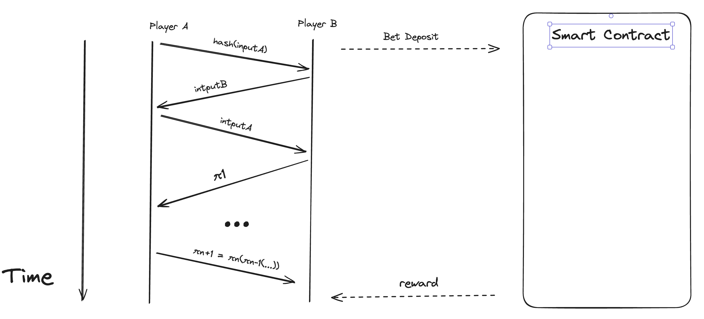

<div align="center">
<br>

<h1>Zero-Knowledge Dice Game</h1>
<strong>The player drawing the higher die wins !</strong>
</div>
<br>

This project is a 2-player betting game levraging Mina Protocol's Zero-Knowledge proof system and privacy, ensuring fairness for the two players without requiring a trusted environment. 

## Randomness 
Once of the current issues when requiring randomness in an on-chain is that is usually requires a trusted setup such as an Oracle. In order to derive a source of randomness, the smart contract requires that both players input two `Field` values. Then it suffices to hash a combination of the two inputs $[input_A, input_B]$ to get a random seed. For every following dice roll, we rehash the previous seed. Thus deriving the following reccurence relation 
$$
seed_i = 
\begin{cases} 
Hash(input_A, input_B) & \text{if } i = 0, \\
Hash(seed_{i-1}) & \text{else } 
\end{cases}
$$ 
In the current implementation the `Poseidon.hash()` function from the o(1)js core library. 

A challenge in this zero-trust environment is that the $Player_B$ must not be aware of $input_A$ at the moment of submitting $input_B$ to the smart contract. In order to avoid this, a handshake inspired by provably fair algorithms can be used: $Player_A$ first submits a $hash(input_A)$ to the smart contract 

## Betting
In the current implementation, the smart contract plays the role of the escrow. In order to play the game both players must first bet the same amount. For each game each player has three possible outcomes:
1. Win: rewarded the bet.
2. Draw: reimboursed the bet.
3. Loose: loose the bet.

## Challenges and Next Steps : Making it P2P
The challenge with the current implementation is that the players use the intermediary of the smart contract for each action. The drawback with the current design is that it would be slow due to the block validation time of the Mina Protocol's blockchain. The next step is to make it P2P, levraging the recursive proving capabilities of the Mina Protocol only communicating with the smart contract for deposing the bet and getting rewarded.

<div align="center">
<br>

</div>
<br>

## How to run the PoC

```sh
cd contracts/
```

```sh
npm run build && node build/src/main.js  
```


## License

[Apache-2.0](LICENSE)
